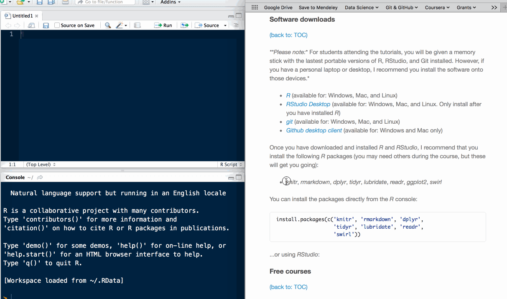

<br>

# Introduction to Biostatistics
An introductory course on data handling and biostatistics for students studying towards a Bachelor of Health Sciences (BHSc) Honours in Physiology at the University of the Witwatersrand, South Africa. The course is based around the statistical programming language [_R_](//www.r-project.org).

The aims of the course are to introduce you to the basics of data wrangling, and reproducible data analysis and reporting. These aims are explored using the statistical computing programme [_R_](//www.r-project.org/) in the [_Rstudio_](//www.rstudio.com) integrated development environment (IDE), and [_git_](//git-scm.com/) (with the [_GitHub_](//github.com/) web-based _git_ repository hosting service) for version control. The reason for choosing these apps is that they are free _(as in beer and as in speech)_, and have well-established and active user and developer communities. You need a basic working knowledge of the _command line_, _R_ and _git_ to complete the course. So if you are not familiar with these apps, I suggest that you complete some free online courses before starting ([see examples below](#free-courses)).

## Course assessment

There will be one project that will constitute the _year mark_ for the course. You **may not work** on the project in groups. Details on the project will be posted at a later date.

The biostatistics component of your mid-year exams will count 60% of the final biostatistics mark (the project will count 40%). 

## Lectures

|Lecture       |Content                                |Slides<br>_(may load slowly)_                                                          |Download slides        |
|:--------------|:--------------------------------------|:------------------------------------------------------------------------|:---------------------|
|Introduction   |Course overview                        |<a href='//dl.dropboxusercontent.com/u/11805474/PHSL4005-biostats/lectures/introduction.html' target='_blank'>Slideshow</a> |[Standalone slides](//dl.dropboxusercontent.com/u/11805474/PHSL4005-biostats/lectures/introduction.html?dl=1)|
|Lecture 1 |Basic concepts and tools for reproducible research|<a href='//dl.dropboxusercontent.com/u/11805474/PHSL4005-biostats/lectures/lecture_1.html' target='_blank'>Slideshow<a/> | [Standalone slides](//dl.dropboxusercontent.com/u/11805474/PHSL4005-biostats/lectures/lecture_1.html?dl=1)|
|Lecture 2 |Data munging|<a href='//dl.dropboxusercontent.com/u/11805474/PHSL4005-biostats/lectures/lecture_2.html' target='_blank'>Slideshow</a> | [Standalone slides](//dl.dropboxusercontent.com/u/11805474/PHSL4005-biostats/lectures/lecture_2.html?dl=1)|

_**[More to be added as course progresses]**_

## Assignments

The assignments are your chance to get hands-on experience applying what you learned in the lectures. The assignments will take place with the course instructor in the computer laboratory immediately after the relevant lecture has finished. You may work alone or in groups.

|Tutorial                   |files                                |
|:--------------------------|:------------------------------------|
|Assignment 1 (lecture 1)   |[[download]](//dl.dropboxusercontent.com/u/11805474/PHSL4005-biostats/assignments/assignment-1.md?dl=1) the file, and follow the instructions |
|Assignment 2 (lecture 2)   |Complete the _swirl_ course: **'Getting and Cleaning Data'** |

_**[More to be added as course progresses]**_

## Resources

_**Please note:** For students attending the tutorials, you will be given a memory stick with the lastest portable versions of R, RStudio, and Git installed. However, if you have a personal laptop or desktop, I recommend you install the software onto those devices._

_If you are using computers in the School of Physiology computer lab, the computers may not have the software installed, or some/all the software may be outdated. If so, please install/update the software. Because computers in the computer laboratory have multiple users, please note the following:_

_Do not set the user configuration using using the global switch before initializing a new git repository:_

```
$ git config --global user.name "YOUR NAME"
$ git config --global user.email "YOUR EMAIL"

$ git init <path/to/directory>
```

_Rather set the configurations only for the local user:_ 

```
$ git config --local user.name "YOUR NAME"
$ git config --local user.email "YOUR EMAIL"

$ git init <path/to/directory>
```

### Software downloads

* [_R_](//cran.r-project.org) (available for: Windows, Mac, and Linux)
* [_RStudio Desktop_](//www.rstudio.com/products/rstudio/download/) (available for: Windows, Mac, and Linux. Only install after you have installed _R_)
* [_git_](//git-scm.com/downloads) (available for: Windows, Mac, and Linux)
* [_Github desktop client_](//desktop.github.com) (available for: Windows and Mac only)

Once you have downloaded and installed _R_ and _RStudio_, I recommend that you install the following _R_ packages (you may need others during the course, but these will get you going):

* _knitr_, _rmarkdown_, _dplyr_, _tidyr_, _lubridate_, _readr_, _ggplot2_, _swirl_

You can install the packages directly from the _R_ console:

```{r eval=FALSE}
install.packages(c('knitr', 'rmarkdown', 'dplyr',
                   'tidyr', 'lubridate', 'readr',
                   'swirl'))
```

<p style="text-align:center">

</p>

<br>

...or using _RStudio_:

<br>

<p style="text-align:center">

</p>

### Free courses

##### _R_ online
* [Introduction to _R_](//www.datacamp.com/courses/free-introduction-to-r) by datacamp.com
* [_R_ Programming](//www.codeschool.com/courses/try-r) by codeschool.com  
* [_R_ for Data Science](//r4ds.had.co.nz) by Garrett Grolemund and Hadley Wickham

##### Learning _R_ with _swirl_
The [_swirl_](//swirlstats.com) package by the Swirl Development Team includes a suite of step-by-step interactive training courses on _R_, which are aimed primarily at the novice _R_ user.

```{r swirl, eval=FALSE}
# Script to install and use 'swirl'
# If you haven't already installed swirl
install.packages('swirl')

# Load the 'swirl' package
library(swirl)

# Launch a 'swirl' session and follow the prompts
swirl()
```

To install _swirl_ courses:
```{r swirl_courses, eval=FALSE}
# Load the 'swirl' package
library(swirl)

# Download a course from the 'swirl' github repository
install_from_swirl('Course Name Here')

# Luanch a 'swirl' session
swirl()
```

Courses include (but are not limited to):

* 'R Programming'
* 'Getting and Cleaning Data'
* 'Exploratory Data Analysis'
* 'Data Analysis'
* 'Regression Models'

##### _git_ online
* [Try _git_](//www.codeschool.com/courses/try-git) by codeschool.com 
* [Learn _git_](//www.codecademy.com/learn/learn-git) by codecademy.com

##### Other
* [Learn the _Command Line_](//www.codecademy.com/learn/learn-the-command-line) by codecademy.com  

### Cheat-sheets

Remembering commands can be difficult, especially when you are a new user or you are out of practice. So here are links to some useful cheat-sheets:  

##### _R_
* [Data wrangling](//www.rstudio.com/wp-content/uploads/2015/02/data-wrangling-cheatsheet.pdf) with _dplyr_ and _tidyr_ from rstudio.com   
- [_RMarkdown_](//www.rstudio.com/wp-content/uploads/2015/02/rmarkdown-cheatsheet.pdf) from rstudio.com  

##### _git_
* [_git_](//www.git-tower.com/blog/git-cheat-sheet/) from git-tower.com  
* [_git_](//training.github.com/kit/downloads/github-git-cheat-sheet.pdf) from github.com
* [_git_ the simple guide](//rogerdudler.github.io/git-guide/) (interactive)
* [_git_ workflow overview](//www.git-tower.com/blog/workflow-of-version-control/) from git-tower.com  

##### Miscellaneous
* [_Command line_](//www.git-tower.com/blog/command-line-cheat-sheet/) from git-tower.com
