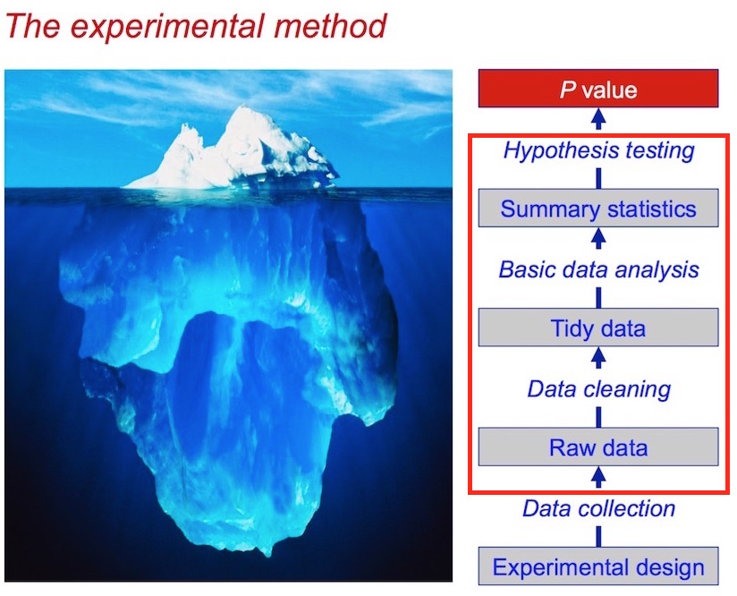
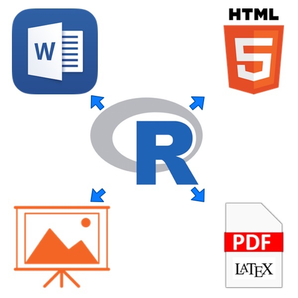

Lecture 1
=========
css: ../custom.css
transition: none
width: 960
height: 720
autosize: false

## Tools for conducting reproducible research

- What is reproducible research?
- Keeping track of things _(version control - git/github)_
- Communicating your data _(RMarkdown - Rstudio)_

<div style="position:fixed;bottom:10%">
    <h3 style="margin:0;">
        Introduction to Biostatistics
    </h3>
    <p style="font-style:italic;font-size:80%;margin-top:1%;margin-bottom:1%;">
        By: Peter Kamerman &nbsp&nbsp (view on
        <a href="//github.com/kamermanpr/biostatistics.git" target="_blank">
            GitHub
        </a>
        )
    </p>
    
</div>

Science under threat
====================

<div class="center" style="width:100%;">
    
</div>


Science under threat
====================

<div class="center" style="width:95%;">
    
</div>

Replicability
=============
incremental: true

<div style="font-size:150%;font-style:italic;text-align:center;margin-top:100px;">
    <p>
    "Confirmation [replication] of findings by an independent group of investigators"
    </p>
</div>

Replication is the ultimate standard for verifying research findings.

_...but it is very time-consuming and expensive exercise._

Reproducibility
===============
type: twocol



****

<div style="text-align:center;margin-top:50px;">
    <p style="font-size:120%;font-style:italic;">
    "The idea that data analyses, and more generally, scientific claims, are published with their data and software code so that others may verify the findings and build upon them."
    </p>
    <p style="text-align:center">
        Roger Peng<br>
        <span style="font-style:italic;font-size:80%;">(Bloomberg School of Public Health)</span>
    </p>
</div>

Basic needs for reproducible research
=====================================
type: twocol
incremental: true

* **Access to the data**
    - Raw & analytical data
    - User-friendly format
* **Adequate documentation**
    - Code sheet
* **Ability to track data processing steps**
    - Version control

****

* **Literate (statistical) programming**
    - Machine readable statistical language
    - Human readable documentation
* **Dissemination**
    - tradiational vs non-tradiational
    - Sustainable/stable hosting infrastructure
    - Searchable / discoverable

Ability to track analysis history
=================================
type: twocol

## Your typical workflow
1. Create
2. Save
3. Edit
4. Save edits
5. REPEAT steps 2 to 4

***

 

<div class="footer" style="font-size:60%;">
    Source: <a href="http://www.phdcomics.com/comics/archive/phd101212s.gif">phdcomics.com</a>
</div>

Git - version control
=====================
type: twocol

## Your typical workflow
1. Create
2. Save
3. Edit
4. Save edits
5. <span style="font-weight:bold;color:red;">REPEAT steps 2 to 4</span>

***
<br>
<br>
<br>

Version control lets you **(and your collaborators)** know:

- When you _'saved'_
- Why you _'saved'_
- What changed

...and lets you share your changes with others

Git: How does it work?
======================
<div>
    
</div>

<div class="footer" style="font-size:60%;">
    Source: <a href="http://www.silverpeas.org/dev/collaboration.html">silverpeas.org</a>
</div>

Git basics
==========

Git is a very powerful tool, but you only need to learn the basics.


Using git
=========
type: tutorial

**Step 1:** Configure _git_ after you first install the app.

```
$ git config --global user.name "YOUR NAME"
$ git config --global user.email "YOUR EMAIL"
```

**Step 2:** Navigate to a directory and intialise _git_.

```
$ cd <path/to/directory>
$ git init
```

**Alt Step 2:** Have _git_ create and intialise an empty directory.

```
$ git init <path/to/directory>
```

Using git ...contd
=========
type: tutorial

**Step 3:** Add a _.gitignore_ file to the directory, with file types you don't want tracked (e.g., <a href="https://www.dropbox.com/s/81l46h93x9s4g8x/.gitignore?dl=0" target="_blank"><em>.gitignore</em></a>).

**Step 4:** Check the status of the files in the directory.

```
$ git status
```

**Step 5:** Add all files to the _git_ staging area.

```
$ git add .
```

Using git ...contd
=========
type: tutorial

**Step 6:** Commit all staged files for the first time _(take a snapshot)_

```
$ git commit -a -m 'First commit'
# -a: commit all staged files
# -m: you MUST provide a meaningful message
```
**Alt Step 6:** Commit selected files.
```
$ git commit <file-name> -m 'First commit'
```

Continuing working and saving files, and _commit_ the changes when you are ready.

If your work generates new output files you want tracked, remember to _add_ and _commit_ those files.

Using git ...contd
=========
type: tutorial

**Undoing changes:**
There are several methods in _git_ to undo changes _(checkout, revert, reset)_. For most cases I recommend using _revert_ because it is safe, and maintains the document history.


```
$ git revert <commit>
```

Using git ...contd
=========
type: tutorial

## Collaborating:
If you have generated something locally and want to _push_ it to a remote repository.

**Step 1:** Open a new, empty respository in your _GitHub_ account.<br>
**Step 2:** Copy the path to the new repository.<br>
**Step 3:** Add _remote_.

```
$ git remote add origin <http://path/to/repo.git>
```
**Step 4:** _Push_ your files to the remote.
```
$ git push origin master
```

Using git ...contd
=========
type: tutorial

## Collaborating:
If you have forked someone elses _GitHub_ repo, then you need to _clone_ it to your local machine.

**Step 1:** Fork a _GitHub_ repo.<br>
**Step 2:** Copy the path to the new repository.<br>
**Step 3:** _clone_ the repo. This process automatically sets the _remote_

```
$ git clone <http://github.com/your-username/repo>
```

Using git ...contd
=========
type: tutorial

## Collaborating:

**Commited changes on the local machine:**

```
$ git push origin master
```

**Commited changes on the remote repo:**

```
$ git pull origin master
```


Using git ...lastly
=========
type: tutorial

**Sync a fork to its upstream source:**

_GitHub_ has lots of features, but no way of keeping your forked repos synced with the upstream source you forked them from. Here is the workaround.

```
$ git remote add upstream <http://path/to/upsteam/repo.git>
$ git fetch upstream
$ git checkout master
$ git merge upstream/master
$ git push origin master
```

Communicating your data
=======================
class: center

## Ideal communication framework
* **Literate (statistical) programming**

* **Easy dissemination to remote repositories**

Literate (statistical) programming
==================================
type: twocol_footer

<div class="footer">
    <div style="font-size:120%">
        <em>R</em> (<strong><em>tangle</em></strong>) + [markdown + knitr (<strong><em>weave</em></strong>)] = <span style="color:#dd4814;font-weight:bold;">RMarkdown</span>
    </div>
</div>

## Requires
- Statistical programming language to _**tangle**_ machine-readable code

- Documentation language to _**weave**_ human-readable documents

****



Dissemination to remote repositories
====================================

<div class="hcenter" style="width:75%;font-size:200%">
    <p>
    <strong>RStudio</strong> + <span style="color:#dd4814;font-weight:bold;">RMarkdown</span>
    
    </p>
</div>

RStudio IDE
===========

<div>
    
</div>

RStudio IDE
===========
type: tutorial
<div class="vcenter">
    <strong style="font-size:200%;">Interactive RStudio demo</strong>
    <p style="color:white;">
        <ul>
            <li>Layout</li>
            <li>Global options</li>
            <li>Rscripts & RMarkdown documents</li>
            <li>Projects & <em>git</em> integration</li>
        </ul>
    </p>
</div>

RMarkdown
=========
The basics


<p class="footer" style="font-size:60%;">Source: <a href="https://www.rstudio.com/wp-content/uploads/2015/02/rmarkdown-cheatsheet.pdf">RStudio</a></p>

RMarkdown
=========
The basics...contd


<p class="footer" style="font-size:60%;">Source: <a href="https://www.rstudio.com/wp-content/uploads/2015/02/rmarkdown-cheatsheet.pdf">RStudio</a></p>

RMarkdown + knitr
=================

_knitr_, by Yihui Xie, revolutionized literate programming in _R_.

_knitr_ is very flexible, allowing you to **knit** together _'chunks'_ of _R_ code with _markdown / html / latex_, and output the resulting file to a variety different formats including:
* _**.docx**_
* _**.pdf**_
* _**.html**_
* _**.md**_

<p class="footer" style="font-size:60%;">Complete documentation: <a href="https://yihui.name/knitr/">knitr</a></p>

RMarkdown + knitr
=================

## Chunk options
In your _RMarkdown_ document, you use regular markdown syntax for typing the documentation, and intersperse _'chunks'_ or _R_ code.

These sections of code can be _**inline**_ or _**blocks**_

RMarkdown + knitr
=================
type: twocol

## Inline

```
The time is `r format(Sys.time(), '%H:%M')`, and I had better be getting to work.
```
The time is 15:51, and I had better be getting to work.

****

## Block

````
```{r}                x <- rnorm(1000) hist(x)                ```
````


RMarkdown + knitr
=================

## Controlling chunk options

<div>
    <strong>Selected examples</strong>
    
</div>

<p class="footer" style="font-size:60%;">Complete documentation: <a href="https://yihui.name/knitr/">knitr</a></p>

RMarkdown + knitr
=================

## Setting global chunk options
<div>
    Example:
  
</div>

Assignment
==========
type: tutorial

<div class="vcenter">
    <p>Download the assignment and follow the instructions.<br><a href="https://dl.dropboxusercontent.com/u/11805474/PHSL4005-biostats/assignments/assignment-1.md?dl=1">[download]</a></p>
</div>


Web resources
=============

## Git / GitHub
- [git the simple guide](https://rogerdudler.github.io/git-guide/)
- [git cheat-sheet](https://ndpsoftware.com/git-cheatsheet.html#loc=workspace) _(interactive)_
- [git cheat-sheet](https://www.git-tower.com/blog/git-cheat-sheet/) _(static)_
- [GitHub Help](https://help.github.com)<br>


## RMarkdown
- [Markdown](https://daringfireball.net/projects/markdown/basics) documentation
- [RMarkdown](https://rmarkdown.rstudio.com) documentation
- [RMarkdown cheat-sheet](https://www.rstudio.com/wp-content/uploads/2015/02/rmarkdown-cheatsheet.pdf)


tl;dr
===================================

<div>
    <p style="font-size:150%;font-style:italic;text-align:center;margin-top:150px;">
    "Statistics are like bikinis. What they reveal is suggestive, but what they conceal is vital"
    </p>
    <p style="text-align:center">
    Aaron Levenstein<br>
        <span style="font-style:italic;font-size:80%;">(Baruch College, CUNY)</span>
    </p>
</div>

tl;dr
===================================
incremental: true
<div>
    <p style="font-size:150%;font-style:italic;text-align:center;margin-top:60px;">
    "Statistics are like bikinis. What they reveal is suggestive, but what they conceal is vital"
    </p>
    <p style="text-align:center">
    Aaron Levenstein<br>
        <span style="font-style:italic;font-size:80%;">(Baruch College, CUNY)</span>
    </p>
</div>

<div>
    <p style="color:blue;font-size:150%;font-style:italic;text-align:center;margin-top:10px;">
    "Think of reproducible research as trying to make the bikini a bit more transparent"
    </p>
</div>


