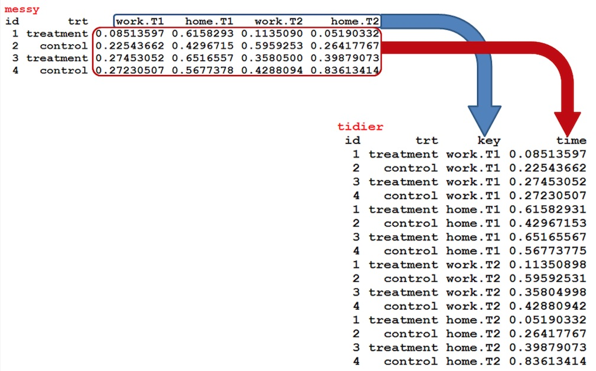
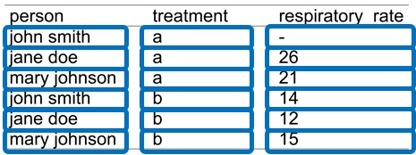
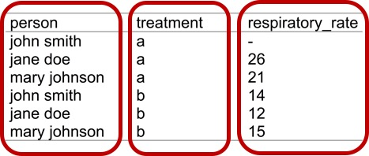
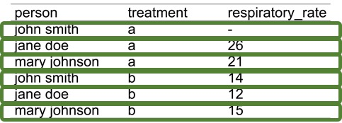
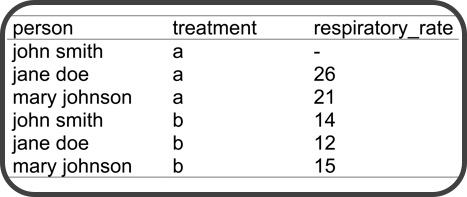

Lecture 2
=========
css: ../custom.css
transition: none
width: 960
height: 720
autosize: false


## Data munging

- What are tidy data?
- Tidying data with _dplyr_ and _tidyr_

<div style="position:fixed;bottom:10%">
    <h3 style="margin:0;">
        Introduction to Biostatistics
    </h3>
    <p style="font-style:italic;font-size:80%;margin-top:1%;margin-bottom:1%;">
        By: Peter Kamerman &nbsp&nbsp (view on
        <a href="//github.com/kamermanpr/biostatistics.git" target="_blank">GitHub</a>)<br>
            Based on the paper:
            <a href="//www.jstatsoft.org/article/view/v059i10" target="_blank">Tidy Data</a> by Hadley Wickam
        </p>
    
</div>

Why tidy data?
==============
type: twocol

## The _tidy data_ concept:

- Provides a standardized layout/organization for data values

## Standardization aids:

- Data exploration and analysis
- Data sharing
- The development of data cleaning and analysis tools

****



Are my data messy?
==================
incremental: true


<p><span style="font-size:150%;">But</span>...<span style="font-style:italic;color:red;">data collected from laboratory experiments</span> typically is collected and captured in a fairly structured format, making the job of tidying the data <span style="font-style:italic;color:red;">not too bad</span>.</p>

Core principles of tidy data
============================

## The language of datasets

- Datasets consist of _**values**_ (usually numbers or strings)

- Every _**value**_ belongs to a _**variable**_ and an _**observation**_

## Structure of a _tidy dataset_

- _**Variables**_ are arranged in _**columns**_

- _**Observations**_ are arranged in _**rows**_

- Each type of observational unit forms a table

Core principles of tidy data
============================
type: twocol

18 _**values**_ <span style="font-size:65%;">(12 strings, 6 numbers)</span>


<span style="line-height:0%;">3 <span style="color:#C00000;font-style:italic;font-weight:bold;">variables</span><span style="font-size:65%;"> [A variable contains all values that measure the same underlying attribute (e.g., respiratory_rate, treatment)]</span></span>


****

<span style="line-height:0%;">6 <span style="color:#548235;font-style:italic;font-weight:bold;">observations</span><span style="font-size:65%;"> [An observation contains all values measured on the same unit across variables (e.g., person, or a day) ]</span></span>


<span style="line-height:0%;">All contained in 1 <span style="color:#404040;font-style:italic;font-weight:bold;">table</span>


Common causes of messiness
==========================
class: vcenter

- Column headers are values, not variable names
- Multiple variables are stored in one column
- Variables are stored in both rows and columns
- Multiple types of experimental unit stored in the same table
- One type of experimental unit stored in multiple tables


Common causes of messiness
==========================

**Column headers are values, not variables**

<div style="width:900px;">
<div style="float:left;width:40%;">
<table>
 <thead>
  <tr>
   <th style="text-align:left;"> religion </th>
   <th style="text-align:right;"> &lt;$20k </th>
   <th style="text-align:right;"> &gt;$20k </th>
  </tr>
 </thead>
<tbody>
  <tr>
   <td style="text-align:left;"> Agnostic </td>
   <td style="text-align:right;"> 61 </td>
   <td style="text-align:right;"> 217 </td>
  </tr>
  <tr>
   <td style="text-align:left;"> Atheist </td>
   <td style="text-align:right;"> 39 </td>
   <td style="text-align:right;"> 124 </td>
  </tr>
  <tr>
   <td style="text-align:left;"> Buddhist </td>
   <td style="text-align:right;"> 48 </td>
   <td style="text-align:right;"> 97 </td>
  </tr>
  <tr>
   <td style="text-align:left;"> Catholic </td>
   <td style="text-align:right;"> 1035 </td>
   <td style="text-align:right;"> 2040 </td>
  </tr>
</tbody>
</table>
</div>

<div style="float:left;width:20%;">

</div>

<div style="float:left;width:40%">
<table>
 <thead>
  <tr>
   <th style="text-align:left;"> religion </th>
   <th style="text-align:left;"> income </th>
   <th style="text-align:right;"> frequency </th>
  </tr>
 </thead>
<tbody>
  <tr>
   <td style="text-align:left;"> Agnostic </td>
   <td style="text-align:left;"> &lt;$20k </td>
   <td style="text-align:right;"> 61 </td>
  </tr>
  <tr>
   <td style="text-align:left;"> Agnostic </td>
   <td style="text-align:left;"> &gt;$20k </td>
   <td style="text-align:right;"> 217 </td>
  </tr>
  <tr>
   <td style="text-align:left;"> Atheist </td>
   <td style="text-align:left;"> &lt;$20k </td>
   <td style="text-align:right;"> 39 </td>
  </tr>
  <tr>
   <td style="text-align:left;"> Atheist </td>
   <td style="text-align:left;"> &gt;$20k </td>
   <td style="text-align:right;"> 124 </td>
  </tr>
  <tr>
   <td style="text-align:left;"> Buddhist </td>
   <td style="text-align:left;"> &lt;$20k </td>
   <td style="text-align:right;"> 48 </td>
  </tr>
  <tr>
   <td style="text-align:left;"> Buddhist </td>
   <td style="text-align:left;"> &gt;$20k </td>
   <td style="text-align:right;"> 97 </td>
  </tr>
  <tr>
   <td style="text-align:left;"> Catholic </td>
   <td style="text-align:left;"> &lt;$20k </td>
   <td style="text-align:right;"> 1035 </td>
  </tr>
  <tr>
   <td style="text-align:left;"> Catholic </td>
   <td style="text-align:left;"> &gt;$20k </td>
   <td style="text-align:right;"> 2040 </td>
  </tr>
</tbody>
</table>
</div>

<div style="clear:both"></div>
</div>

Common causes of messiness
==========================

**Multiple variables stored in one column**

<div style="float:left;">
<table>
 <thead>
  <tr>
   <th style="text-align:left;"> country </th>
   <th style="text-align:right;"> year </th>
   <th style="text-align:left;"> sex_age </th>
   <th style="text-align:right;"> frequency </th>
  </tr>
 </thead>
<tbody>
  <tr>
   <td style="text-align:left;"> ZW </td>
   <td style="text-align:right;"> 2002 </td>
   <td style="text-align:left;"> m014 </td>
   <td style="text-align:right;"> 191 </td>
  </tr>
  <tr>
   <td style="text-align:left;"> ZW </td>
   <td style="text-align:right;"> 2002 </td>
   <td style="text-align:left;"> m1524 </td>
   <td style="text-align:right;"> 600 </td>
  </tr>
  <tr>
   <td style="text-align:left;"> ZW </td>
   <td style="text-align:right;"> 2002 </td>
   <td style="text-align:left;"> m2534 </td>
   <td style="text-align:right;"> 2548 </td>
  </tr>
  <tr>
   <td style="text-align:left;"> ZW </td>
   <td style="text-align:right;"> 2002 </td>
   <td style="text-align:left;"> m3544 </td>
   <td style="text-align:right;"> 1662 </td>
  </tr>
</tbody>
</table>
</div>

<div style="transform:rotate(45deg);margin-left:200px;margin-top:200px;" >

</div>

<div style="float:right;">
<table>
 <thead>
  <tr>
   <th style="text-align:left;"> country </th>
   <th style="text-align:right;"> year </th>
   <th style="text-align:right;"> frequency </th>
   <th style="text-align:left;"> sex </th>
   <th style="text-align:left;"> age_range </th>
  </tr>
 </thead>
<tbody>
  <tr>
   <td style="text-align:left;"> ZW </td>
   <td style="text-align:right;"> 2002 </td>
   <td style="text-align:right;"> 191 </td>
   <td style="text-align:left;"> male </td>
   <td style="text-align:left;"> 0-14 </td>
  </tr>
  <tr>
   <td style="text-align:left;"> ZW </td>
   <td style="text-align:right;"> 2002 </td>
   <td style="text-align:right;"> 600 </td>
   <td style="text-align:left;"> male </td>
   <td style="text-align:left;"> 15-24 </td>
  </tr>
  <tr>
   <td style="text-align:left;"> ZW </td>
   <td style="text-align:right;"> 2002 </td>
   <td style="text-align:right;"> 2548 </td>
   <td style="text-align:left;"> male </td>
   <td style="text-align:left;"> 25-34 </td>
  </tr>
  <tr>
   <td style="text-align:left;"> ZW </td>
   <td style="text-align:right;"> 2002 </td>
   <td style="text-align:right;"> 1662 </td>
   <td style="text-align:left;"> male </td>
   <td style="text-align:left;"> 35-44 </td>
  </tr>
</tbody>
</table>
</div>

Common causes of messiness
==========================

**Variables are stored in both rows and columns**

<div>
<div>
<table>
 <thead>
  <tr>
   <th style="text-align:left;"> site_id </th>
   <th style="text-align:right;"> year </th>
   <th style="text-align:right;"> month </th>
   <th style="text-align:left;"> element </th>
   <th style="text-align:right;"> d1 </th>
   <th style="text-align:right;"> d2 </th>
   <th style="text-align:right;"> d3 </th>
  </tr>
 </thead>
<tbody>
  <tr>
   <td style="text-align:left;"> MX000017004 </td>
   <td style="text-align:right;"> 2010 </td>
   <td style="text-align:right;"> 11 </td>
   <td style="text-align:left;"> TMAX </td>
   <td style="text-align:right;"> 313 </td>
   <td style="text-align:right;"> 272 </td>
   <td style="text-align:right;"> 263 </td>
  </tr>
  <tr>
   <td style="text-align:left;"> MX000017004 </td>
   <td style="text-align:right;"> 2010 </td>
   <td style="text-align:right;"> 11 </td>
   <td style="text-align:left;"> TMIN </td>
   <td style="text-align:right;"> 163 </td>
   <td style="text-align:right;"> 120 </td>
   <td style="text-align:right;"> 79 </td>
  </tr>
</tbody>
</table>
</div>

<div>

</div>

<div>
<table>
 <thead>
  <tr>
   <th style="text-align:left;"> site_id </th>
   <th style="text-align:right;"> year </th>
   <th style="text-align:right;"> month </th>
   <th style="text-align:right;"> day </th>
   <th style="text-align:right;"> max_temp_F </th>
   <th style="text-align:right;"> min_temp_F </th>
  </tr>
 </thead>
<tbody>
  <tr>
   <td style="text-align:left;"> MX000017004 </td>
   <td style="text-align:right;"> 2010 </td>
   <td style="text-align:right;"> 11 </td>
   <td style="text-align:right;"> 1 </td>
   <td style="text-align:right;"> 313 </td>
   <td style="text-align:right;"> 163 </td>
  </tr>
  <tr>
   <td style="text-align:left;"> MX000017004 </td>
   <td style="text-align:right;"> 2010 </td>
   <td style="text-align:right;"> 11 </td>
   <td style="text-align:right;"> 2 </td>
   <td style="text-align:right;"> 272 </td>
   <td style="text-align:right;"> 120 </td>
  </tr>
  <tr>
   <td style="text-align:left;"> MX000017004 </td>
   <td style="text-align:right;"> 2010 </td>
   <td style="text-align:right;"> 11 </td>
   <td style="text-align:right;"> 3 </td>
   <td style="text-align:right;"> 263 </td>
   <td style="text-align:right;"> 79 </td>
  </tr>
</tbody>
</table>
</div>
</div>

Common causes of messiness
==========================

**Variables are stored in both rows and columns**

<div>
<div>
<table>
 <thead>
  <tr>
   <th style="text-align:right;"> year </th>
   <th style="text-align:left;"> artist </th>
   <th style="text-align:left;"> track </th>
   <th style="text-align:left;"> time </th>
   <th style="text-align:right;"> week </th>
   <th style="text-align:right;"> rank </th>
   <th style="text-align:left;"> date </th>
  </tr>
 </thead>
<tbody>
  <tr>
   <td style="text-align:right;"> 2000 </td>
   <td style="text-align:left;"> 2 Pac </td>
   <td style="text-align:left;"> Baby Don't Cry </td>
   <td style="text-align:left;"> 04:22 </td>
   <td style="text-align:right;"> 1 </td>
   <td style="text-align:right;"> 87 </td>
   <td style="text-align:left;"> 26/02/2000 </td>
  </tr>
  <tr>
   <td style="text-align:right;"> 2000 </td>
   <td style="text-align:left;"> 2 Pac </td>
   <td style="text-align:left;"> Baby Don't Cry </td>
   <td style="text-align:left;"> 04:22 </td>
   <td style="text-align:right;"> 2 </td>
   <td style="text-align:right;"> 82 </td>
   <td style="text-align:left;"> 04/03/2000 </td>
  </tr>
  <tr>
   <td style="text-align:right;"> 2000 </td>
   <td style="text-align:left;"> 2 Pac </td>
   <td style="text-align:left;"> Baby Don't Cry </td>
   <td style="text-align:left;"> 04:22 </td>
   <td style="text-align:right;"> 3 </td>
   <td style="text-align:right;"> 72 </td>
   <td style="text-align:left;"> 11/03/2000 </td>
  </tr>
  <tr>
   <td style="text-align:right;"> 2000 </td>
   <td style="text-align:left;"> 2 Pac </td>
   <td style="text-align:left;"> Baby Don't Cry </td>
   <td style="text-align:left;"> 04:22 </td>
   <td style="text-align:right;"> 4 </td>
   <td style="text-align:right;"> 77 </td>
   <td style="text-align:left;"> 18/03/2000 </td>
  </tr>
  <tr>
   <td style="text-align:right;"> 2000 </td>
   <td style="text-align:left;"> 2 Pac </td>
   <td style="text-align:left;"> Baby Don't Cry </td>
   <td style="text-align:left;"> 04:22 </td>
   <td style="text-align:right;"> 5 </td>
   <td style="text-align:right;"> 87 </td>
   <td style="text-align:left;"> 25/03/2000 </td>
  </tr>
  <tr>
   <td style="text-align:right;"> 2000 </td>
   <td style="text-align:left;"> 2 Pac </td>
   <td style="text-align:left;"> Baby Don't Cry </td>
   <td style="text-align:left;"> 04:22 </td>
   <td style="text-align:right;"> 6 </td>
   <td style="text-align:right;"> 94 </td>
   <td style="text-align:left;"> 01/04/2000 </td>
  </tr>
</tbody>
</table>
</div>

<div>
<p style="text-align:middle;margin-left:90px;">Split into song and rank information</p>

</div>
</div>

Common causes of messiness
==========================

**Variables are stored in both rows and columns**

Table 1: Song information
<table>
 <thead>
  <tr>
   <th style="text-align:left;"> artist </th>
   <th style="text-align:left;"> track </th>
   <th style="text-align:right;"> year </th>
   <th style="text-align:left;"> time </th>
  </tr>
 </thead>
<tbody>
  <tr>
   <td style="text-align:left;"> 2 Pac </td>
   <td style="text-align:left;"> Baby Don't Cry </td>
   <td style="text-align:right;"> 2000 </td>
   <td style="text-align:left;"> 04:22 </td>
  </tr>
  <tr>
   <td style="text-align:left;"> 2Ge+her </td>
   <td style="text-align:left;"> The Hardest Part Of Breaking Up </td>
   <td style="text-align:right;"> 2000 </td>
   <td style="text-align:left;"> 03:15 </td>
  </tr>
  <tr>
   <td style="text-align:left;"> 3 Doors Down </td>
   <td style="text-align:left;"> Kryptonite </td>
   <td style="text-align:right;"> 2000 </td>
   <td style="text-align:left;"> 03:53 </td>
  </tr>
</tbody>
</table>

Table 2: Chart information
<table>
 <thead>
  <tr>
   <th style="text-align:left;"> artist </th>
   <th style="text-align:left;"> track </th>
   <th style="text-align:left;"> date </th>
   <th style="text-align:right;"> rank </th>
  </tr>
 </thead>
<tbody>
  <tr>
   <td style="text-align:left;"> 2 Pac </td>
   <td style="text-align:left;"> Baby Don't Cry </td>
   <td style="text-align:left;"> 01/04/2000 </td>
   <td style="text-align:right;"> 94 </td>
  </tr>
  <tr>
   <td style="text-align:left;"> 2 Pac </td>
   <td style="text-align:left;"> Baby Don't Cry </td>
   <td style="text-align:left;"> 04/03/2000 </td>
   <td style="text-align:right;"> 82 </td>
  </tr>
  <tr>
   <td style="text-align:left;"> 2 Pac </td>
   <td style="text-align:left;"> Baby Don't Cry </td>
   <td style="text-align:left;"> 08/04/2000 </td>
   <td style="text-align:right;"> 99 </td>
  </tr>
</tbody>
</table>

Common causes of messiness
==========================

**Single document type is stored in multiple tables**

Data values about a single type of observational unit may be spread out over multiple tables or files.

These tables and files are often split up by another variable (e.g., each table represents a single year, person, or location).

As long as the format for individual records is consistent, this is an easy problem to fix by merging tables.

Tools to tidy and manipulate data
=================================

## The _grammer_ of data cleaning

**Primary _tidyr_ package verbs**
- `gather()`: gathers multiple columns into a key-value pair
- `spread()`: spreads two columns (key-value pair) in to multiple columns

Tools to tidy and manipulate data
=================================

## The _grammer_ of manipulating data

**Primary _dplyr_ package verbs**
- `select()`: focus on a subset of variables (columns)
- `filter()`: focus on a subset of rows
- `mutate()`: add new columns
- `summarise()`: produce summary statistics of variables
- `arrange()`: re-order rows

Examples: set-up
================
type: tutorial
class: center


```r
# install required packages
install.packages(c('tidyr', 'dplyr'))

# load packages
library(tidyr) # to tidy data
library(dplyr) # to manipulate data
```

Examples: tidyr
===============
type: tutorial

`gather()`: gathers multiple columns into a key-value pair

```r
# check documentation
?gather()

# use a sample of the 'iris' dataset
mini_iris <- iris[c(1, 51, 101), ]

# gather flower attributes:
gathered <- gather(data = mini_iris,
                   key = flower_attr,
                   value = measurement_mm,
                   Sepal.Length, Sepal.Width,
                   Petal.Length, Petal.Width)

# inspect and compare 'mini_iris'
# and 'gathered'
```

Examples: tidyr
===============
type: tutorial

`spread()`: spreads two columns (key-value pair) in to multiple

```r
# check documentation
?spread()

# spread is the reverse of `gather()`
spreading <- spread(data = gathered,
                    key = flower_attr,
                    value = measurement_mm)

# inspect and compare 'mini_iris', 'gathered',
# and 'spreading'
```

Examples: dplyr
===============
type: tutorial

`select()`: focus on a subset of variables (columns)

```r
# check documentation (note special functions)
?select()

# try some options on the 'iris' dataset
select(iris, Petal.Length, Petal.Width)
select(iris, starts_with("Petal"))
select(iris, ends_with("Width"))
select(iris, contains("etal"))
select(iris, matches(".t."))
select(iris, Petal.Length, Petal.Width)
vars <- c("Petal.Length", "Species")
select(iris, one_of(vars))

# redo examples, but put '-' before
# the variables
```

Examples: dplyr
===============
type: tutorial

`filter()`: focus on a subset of rows using relational and logical operators

```r
# check documentation (note special functions)
?filter()

# try some filters on the 'mtcars' dataset
filter(mtcars, cyl == 8) # '==': EQUAL TO
filter(mtcars, cyl < 6) # '<': LESS THAN
filter(mtcars, cyl < 6 & vs == 1) # '&': AND
filter(mtcars, cyl < 6, vs == 1) # SAME AS '&'
filter(mtcars, cyl < 6 | vs == 1) # '|': OR
```

Examples: dplyr
===============
type: tutorial

`mutate()`: add new columns

```r
# check documentation
?mutate()

# using 'mtcars' dataset
# add a new column with displacement in litres
mutate(mtcars,
       displ_l = disp / 61.0237)

# transmute adds column, dropping all others
transmute(mtcars,
          displ_l = disp / 61.0237)
```

Examples: dplyr
===============
type: tutorial

`summarise()`: produce summary statistics of variables

```r
# check documentation
?summarise()

# use summary functions on 'mtcars' dataset
summarise(mtcars,
          mean(disp))

# use with 'group_by'
summarise(group_by(mtcars, cyl),
          mean(disp))

# get multiple summary stats
summarise(group_by(mtcars, cyl),
          m = mean(disp),
          sd = sd(disp))
```

Examples: dplyr
===============
type: tutorial

`arrange()`: re-order rows

```r
# check documentation
?arrange()

# arrange 'mtcars' dataset
# default is ascending order
arrange(mtcars, cyl)

# use 'desc' to reverse the default
arrange(mtcars, desc(disp))

# arrange by multiple variables
arrange(mtcars, cyl, desc(disp))
```

Examples: Piping ('%>%')
========================
type: tutorial

Piping (`%>%`) functionality:
- Is automatically imported into _dplyr_ and _tidyr_ from the _magrittr_ package
- Allows the output from one command to be fed into the next.
- _'Unclutters'_ long commands


```r
# using '%>%' on the 'mtcars' dataset
# pass final result to 'by_cyl'
by_cyl <- mtcars %>%
    group_by(cyl) %>%
    summarise(a = n(), b = a + 1) %>%
    arrange(a)
by_cyl
```

Assignment
==========
type: tutorial

<div class="vcenter">
    <p>Complete <em>swirl</em> course: <span style="font-weight:bold;">'Getting and Cleaning Data'</span></p>
</div>

Web resources
=============

## Tidy data
- Wickham H. Tidy data. _J Stat Softw_ **59**: 1-23, 2014. DOI: [10.18637/jss.v059.i10](//dx.doi.org/10.18637/jss.v059.i10)
- [Tidy data vignette](//cran.r-project.org/web/packages/tidyr/vignettes/tidy-data.html)


## _dplyr_ and _tidyr_ packages
- [Introduction to _dplyr_](https://cran.rstudio.com/web/packages/dplyr/vignettes/introduction.html)
- [Introduction to _tidyr_](//blog.rstudio.org/2014/07/22/introducing-tidyr/)
- [_dplyr_ and _tidyr_ cheat-sheet](//www.rstudio.com/wp-content/uploads/2015/02/data-wrangling-cheatsheet.pdf)

tl;dr
===================================
incremental: true

<div class="center", style="width:80%;">
    <p style="font-size:150%;font-style:italic;text-align:center;margin-top:60px;">
    "Data that is loved tends to survive."
    </p>
    <p style="text-align:center">
     Kurt Bollacker<br>
        <span style="font-style:italic;font-size:80%;">(Data Scientist, Freebase/Infochimps)</span>
    </p>
</div>

