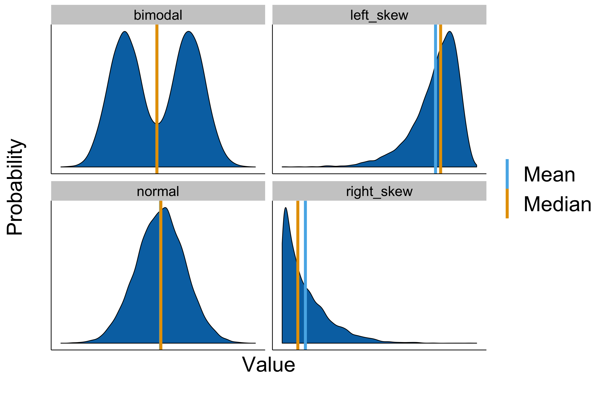
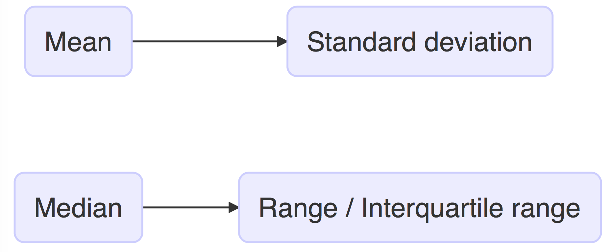

Lecture 3
=========
css: ../custom.css
transition: none
width: 960
height: 720
autosize: false

## Things to know before you start data analysis:

- The type of data you have
- What *p-value < 0.05* means

    <h3 style="margin:0;">
        Introduction to Biostatistics
    </h3>
    

        By: Peter Kamerman &nbsp&nbsp (view on
        <a href="//github.com/kamermanpr/biostatistics.git" target="_blank">GitHub</a>)
    

    

Type of data
============
title: none
type: aside

What type of data do I have...

Types of data
=============

Types of data: Categorical
==========================

    

Types of data: Numerical
========================

    

Measurement scales
==================
class: vcenter

**Ordinal scales**
- Allows ordering of measurement
- Does not allow assesment of relative degree of difference between items

    

Measurement scales
==================

**Interval scales**
- No true _zero_
- Allows assesment of relative degree of difference between items
- Does not allow assessment of the ratio between items

    

Measurement scales
==================

**Ratio scales**
- Has a _true zero_
- Allows assesment of relative degree of difference between items
- Allows the assessment of the ratio between items

    

Remember what statistics is
===========================
title: none
type: aside

Remember what statistics is...

Remember what statistics is...contd
===================================
title: none
incremental: true

    

    "Statistics is the science of learning generalizable knowledge from data"
    

Remember what statistics is...contd2
====================================
title: none

Statistics is about inference.

    Source: <a href="http://jtleek.com/genstats_site/">Jeff Leek</a>

Type of data matters
====================
class: vcenter

**The distribution of the measured variable depends on:**

- The probability distribution of the variable in the population
- The sample size
- Sampling procedure *(e.g., probability vs non-probability sampling)*
- The level of measurement *(e.g., count, continuous)*

Common probability distributions
================================

The normal distribution
=======================

**The _Normal_ distribution is characterized by two parameters:**
- Mean ($\bar{x}$)
- Standard deviation ($sd$)

The normal distribution
=======================
class: vcenter

**What are the _mean_ and _sd_?**

- Sample mean:&nbsp;&nbsp;&nbsp;&nbsp; $\bar{x} = \frac{\sum{X}_{i}}{n}$

- Sample variance:&nbsp;&nbsp;&nbsp;&nbsp; $s^2 = \frac{\sum(x_{i}-\bar{x})^2}{(n-1)}$

- Sample standard deviation (SD):&nbsp;&nbsp;&nbsp;&nbsp; $sd = \sqrt{\frac{\sum(x_{i}-\bar{x})^2}{(n-1)}}$

The normal distribution
=======================
class: vcenter

**How do I know when my data follow a _Gaussian distribution_?**

- Consider the source of scatter
- Look at data (outliers?)
- Consider type of data (rank or score?)
- Use tests for normality (e.g. chi-square, Kolmogorov-Smironov) _(large samples only)_
- Look at all available data

Other measures of central tendancy
==================================

**How do you summarise data that are not normally distributed?**

- **Median:** The middle value  
1 | 2 | 3 | 4 | 10 | 100 | 10000  
_Mean = 1446 | Median = 4_

- **Mode:** The most common value  
1 | 1 | 1 | 1 | 2 | 2 | 2 | 4 | 10   
_Mean = 3 | Median = 2 | Mode = 1_

Choosing a measure of central tendancy
======================================

- The level of measurement (e.g., nominal, ordinal, interval)

    

- Shape of the frequency distribution (e.g., normal, left-skewed)

    

Measures of variability (dispersion)
====================================
class: center

    

SEM vs SD
=========
title: none
type: aside

What about the _standard error of the mean_?

SD vs SEM
=========
class: vcenter

**Standard deviation** _($sd$):_ Refers to variability 			(spread/dispersion) between individual measurements.
 
 
 
 
**Standard error of the mean** _($sem$):_ Refers to the certainty (precision) with which the sample mean _($\bar{x}$)_ estimates the population mean _($\mu$)_.

SEM
===
type: twocol

$sem$ = $sd$ of sample means

****

The precision for estimating the mean increases as sample size increases _(i.e. as sample size increases, SEM decreases)_.

$sem$ = $\frac{sd}{\sqrt{n}}$

Central Limit Theorem
=====================

    

    "...[The] distribution of sample means has an approximate normal distribution, no matter what the distribution of the original data looks like, as long as the sample size is large enough (usually at least 30), and all samples have the same size."  
    "...[This] doesn’t just apply to the sample mean...[and holds] true for other sample statistics, such as the sample proportion."
    

    Source: <a href="http://www.dummies.com/how-to/content/how-the-central-limit-theorem-is-used-in-statistic.html">Deborah Rumsey, Statistics for Dummies, 2e</a>

Central Limit Theorem
=====================
type: twocol

    <strong>The population</strong> 
    (n = 20 000)
    

****

    <strong>The mean of sample means</strong>
      
    

The p-value
===========
title: none
type: aside

What does the p-value mean?

The p-value
===========
class: vcenter

**Does _p_ < 0.05 allow you to know any of the following?**

1. The probability that the null hypothesis was true.
2. The probability that the alternative hypothesis was true.
3. The probability that the observed effect was real.
4. The probability that a claim of a positive result is a false positive.
5. The probability that the result can be replicated.
6. The strength of evidence in the data against the null hypothesis.

Definition of a p-value
=======================

    

    "The probability of observing a result as great as (or greater than) than you got if the null hypothesis is true."
    

     
    

    If the data are unlikely under the null hypothesis (small p-value), then either we observed a low probability event, <strong>or</strong> it must be that the null hypothesis is not true.  ...only one of these can be correct.
  

    Source: <a href="http://bayesianbiologist.com/2011/08/21/p-value-fallacy-on-more-or-less/">Corey Chivers, bayesianbiologist</a>

And that means?
===============

**The _p-value_:**

1. **is not** the probability that the null hypothesis is true, nor is it the probability that the alternative hypothesis is false.

2. **is not**  the probability that a finding is "merely a fluke".

3. **is not**  the probability of falsely rejecting the null hypothesis.

4. **is not**  the probability that replicating the experiment would yield the same conclusion.

5. **does not** indicate the size or importance of the observed effect

Significance testing
====================

**Ronald Fisher:**
- Recommended using the p-value as a rough numerical guide of the strength of the evidence against the null hypothesis.

- He arbitrarily chose P<0.05 as a p-value that was “significant” or “noteworthy”, and required further experimentation (experimental replicates) to confirm the finding.

- Significance testing allows you to take other evidence into account when interpreting the data _(e.g., pre-existing evidence)_.

Hypothesis testing
==================

**Jerzy Neyman and Egon Pearson:**
- Works by setting a threshold _p-value_.

- You state a _null hypothesis_ and an _alternative hypothesis_ and use the _threshold p-value_ as a decision rule.

- The _threshold p-value_ is chosen to control false positive inference, alpha (usually 0.05).

- You have to abide by the statistical test's 'decision' if you wish to protect against false positive errors.

Hypothesis testing
==================
type: twocol

 
 
**Advantages:**
- Crisp, clear-cut _'yes'_ or _'no'_ answer

****

 
 
**Disadvantages:**
- Statistical significance **does not imply** biological or clinical significance.

- False rejection of the null hypothesis **(false positives)**

- False acceptance of the null hypothesis **(false negatives)**

Type I and Type II statistical errors
=====================================

**Type I error _($\alpha$)_:**
- Claim statistical significance when there is not one.

- $\alpha = 0.05$ means that there is a 5% chance of falsely concluding that the samples are from different populations (assuming the null hypothesis is true).

**Type II error _($\beta$)_:**
- Claim no statistical significance when there is one.

- Note that $\beta \neq 1 - \alpha$

Statisical power
================

Power refers to the chance of detecting a true difference between two populations.

$Power = 1 - \beta$ 

**The power of a statistical test depends on:**
- The risk of error you are willing to tolerate when rejecting the null hypothesis _(setting $\alpha$)_
- The size of difference you want to detect relative to the variability in the population.
- The sample size.
- The variability in observations.

Tails
=====

    

Tails...contd
=============
type: twocol

    
    

****

**One-tailed _p-value_:**

The probability of detecting a difference between groups, with one pre-defined group having the larger mean.  
Must accept null hypothesis if direction of change is opposite to what was predicted.

**Two-tailed _p-value_:**

The probability of detecting a difference between groups, with either group having the larger mean.

Web resources
=============
class: vcenter

Nuzzo R. Statistical errors: P-values, the 'gold standard' of statistical validity, are not as reliable as many scientists assume. [Nature.com](//www.nature.com/news/scientific-method-statistical-errors-1.14700), 2014.

tl;dr
===================================
incremental: true

    

    "... surely, God loves the .06 nearly as much as the .05."
    

    

     Ralf Rosnow & Robert Rosenthal 
        (American Psychologist 44: 1276-1284, 1989)
    

