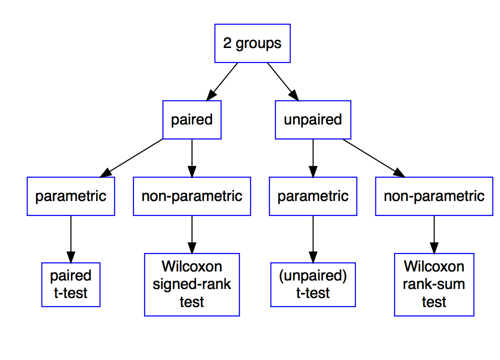
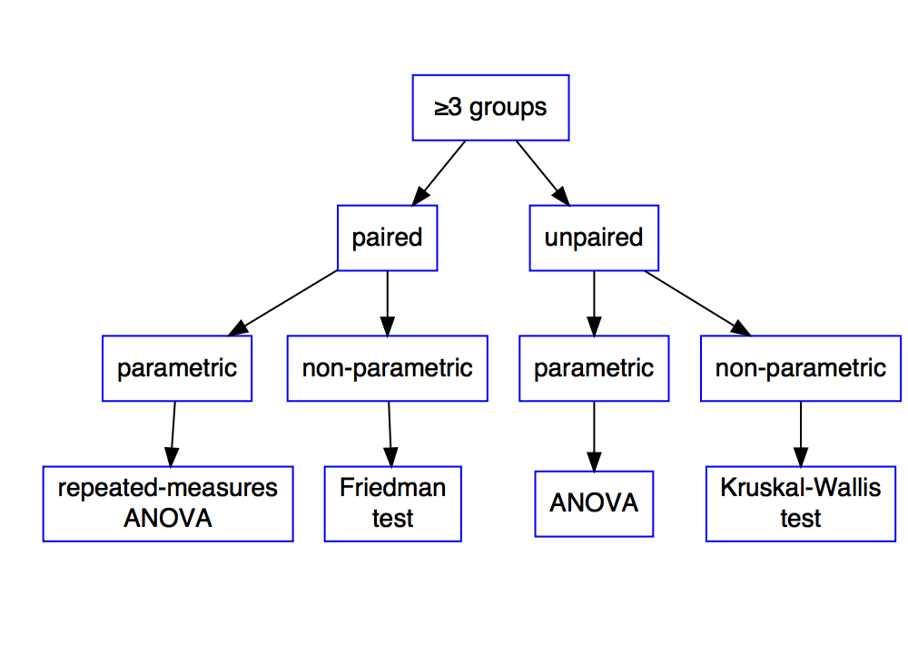
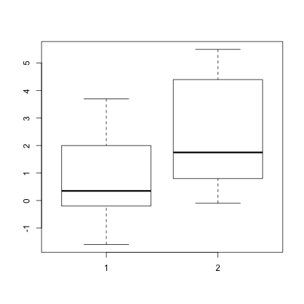
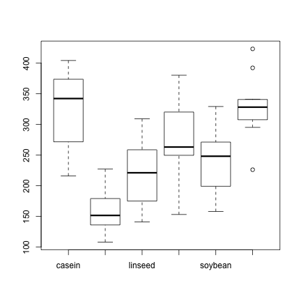
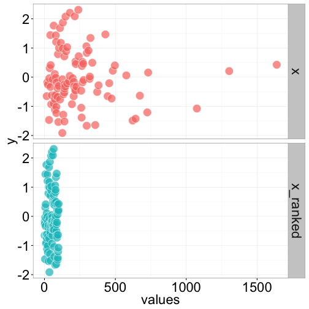

Lecture 5
=========
css: ../custom.css
transition: none
width: 960
height: 720
autosize: false


## Cookbook of commonly used statistical tests

- Comparing two groups
- Comparing more than two groups

<div style="position:fixed;bottom:10%">
    <h3 style="margin:0;">
        Introduction to Biostatistics
    </h3>
    <p style="font-style:italic;font-size:80%;margin-top:1%;margin-bottom:1%;">
        By: Peter Kamerman &nbsp&nbsp (view at
        <a href="//painblogr.org/biostatistics/" target="_blank">painblogR</a>)
    </p>
    
</div>

Recap
=====
title: hide
type: aside

A quick recap on:<br>_p-values & hypothesis testing_

Definition of a p-value
=======================

<div>
    <p style="font-size:150%;font-style:italic;text-align:center;margin-top:60px;">
    "The probability of observing a result as great as (or greater than) you observed if the null hypothesis is true."
    </p>
    <br>
    <p style="text-align:center;">
    If the data are unlikely under the null hypothesis (small p-value), then either we observed a low probability event, <strong>or</strong> it must be that the null hypothesis is not true.<br><br>...only one of these can be correct.
  </p>
</div>

<div class="footer" style="font-size:60%;">
    Source: <a href="http://bayesianbiologist.com/2011/08/21/p-value-fallacy-on-more-or-less/">Corey Chivers, bayesianbiologist</a>
</div>

Hypothesis testing
==================

**Jerzy Neyman and Egon Pearson:**
- Works by setting a threshold $(\alpha)$ that the p-value must cross.

- You state a _null hypothesis_ and an _alternative hypothesis_ and use the _threshold p-value_ as a decision rule.

- The _p-value threshold_ is chosen to control false-positive inference (usually set at $\alpha$ = 0.05).

- You have to abide by the statistical test's 'decision' if you wish to protect against false-positive errors.

Which test?
===========



Which test?
===========



Parametric tests
================

**Experimental groups may differ for two reasons:**

1. Real effect of intervention

2. Random variation between samples drawn from the same population

<h3 style="text-align:center;">You must decide whether:</h3>
<p style="text-align:center;"><bold>[1]</bold> is large enough relative to <bold>[2]</bold> to conclude<br>that a treatment had an effect.</p>

Parametric tests
================

**Calculate the ratio of variances**

1. between-group variance $(\sigma^2_{bet})$

2. within-group variance $(\sigma^2_{with})$

<p style="text-align:center;">If samples are from the same population,<br>the variances will be similar, and...</p>

<p style="text-align:center;">$\frac{\sigma^2_{bet}}{\sigma^2_{with}} \rightarrow 1$</p>

<p style="text-align:center;">Degrees of Freedom <em>(df)</em> determine the critical value the ratio <em>(test statistic)</em> must reach for the null hypothesis to be rejected.</p>

Assumptions for parametric tests
=================================
class: vcenter

- The distribution of the data in the population is _Gaussian_

- Equal variance across groups<br>_(the basis on which the test statistic is calculated)_

- The errors are independent<br>_(the 'error' refers to the difference between each value and the mean)_

- Data are unmatched _(for unpaired data)_ / matching is effective _(for repeated measures data)_

Student's t-test
================
type: twocol

First have a look at the data

```r
data(sleep)
head(sleep)
```

```
  extra group ID
1   0.7     1  1
2  -1.6     1  2
3  -0.2     1  3
4  -1.2     1  4
5  -0.1     1  5
6   3.4     1  6
```

****
<br>

```r
boxplot(extra~group, data = sleep)
```



Student's t-test
================
Run _t-test_


```r
# When you data are in long format:
t.test(extra ~ group, # formula
       data = sleep,  # data source
       paired = TRUE) # paired or unpaired

# If your data are in wide format,
# you can use the default format:
> t.test(x, y, ...)
```

Student's t-test
================

Output

```

	Paired t-test

data:  extra by group
t = -4.0621, df = 9, p-value = 0.002833
alternative hypothesis: true difference in means is not equal to 0
95 percent confidence interval:
 -2.4598858 -0.7001142
sample estimates:
mean of the differences 
                  -1.58 
```

One-way ANOVA
=============
Use when the grouping factor has $\geq$ 3 levels.

**One-way ANOVA**

```r
foo <- aov(outcome ~ factor_1,
           data = dataframe)
summary(foo)
```

**One-way repeated-measures ANOVA**

```r
bar <- aov(outcome ~ factor_2 +
               Error(subjectID), # rep measure
           data = dataframe)
summary(bar)
```

Two-way ANOVA
=============

**Two-way ANOVA**

```r
foo <- aov(outcome ~ factor_1 * factor_2,
           data = dataframe)
summary(foo)

# For main effects only:
> aov(outcome ~ factor_1 + factor_2,...)

# For repeated measures:
> aov(outcome ~ factor_1 + factor_2 +
          Error(subjectID), ...)
```

**NB:** `aov` uses _Type I SS_, so order matters.<br>
**Equivalent to Type III SS:** `drop1(foo, ~., test = 'F')`

Example: One-way ANOVA
======================
type: twocol


```r
data("chickwts")
head(chickwts)
```

```
  weight      feed
1    179 horsebean
2    160 horsebean
3    136 horsebean
4    227 horsebean
5    217 horsebean
6    168 horsebean
```

****


```r
boxplot(weight ~ feed,
        data =
            chickwts)
```



Example: One-way ANOVA
======================


```r
# One-way ANOVA
foo <- aov(weight ~ feed,
           data = chickwts)
summary(foo)
```

```
            Df Sum Sq Mean Sq F value   Pr(>F)    
feed         5 231129   46226   15.37 5.94e-10 ***
Residuals   65 195556    3009                     
---
Signif. codes:  0 '***' 0.001 '**' 0.01 '*' 0.05 '.' 0.1 ' ' 1
```


Post-hoc tests
==============

**NB:** Need to correct $(\alpha)$ for multiple comparisons<br>to avoid inflation of type I error.

$Bonferroni = \frac{target~p-value}{number~of~comparisons~(n)}$<br><br>
$Holm = \frac{target~p-value}{n - rank~number~in~terms~of ~degree~of~significance + 1}$


```r
# Pairwise post-hoc tests
pairwise.t.test(chickwts$weight, chickwts$feed,
                p.adjust.method = 'holm',
                paired = FALSE)

# Several correction methods are available.
```

Post-hoc tests
==============


```

	Pairwise comparisons using t tests with pooled SD 

data:  chickwts$weight and chickwts$feed 

          casein  horsebean linseed meatmeal soybean
horsebean 2.9e-08 -         -       -        -      
linseed   0.00016 0.09435   -       -        -      
meatmeal  0.18227 9.0e-05   0.09435 -        -      
soybean   0.00532 0.00298   0.51766 0.51766  -      
sunflower 0.81249 1.2e-08   8.1e-05 0.13218  0.00298

P value adjustment method: holm 
```


Post-hoc tests...contd
==============

What if you don't need to compare all pairs?

Pre-planned _(non-orthogonal)_ comparisons

```r
# Make a vector of p-values from each of
# the planned comparisons
p <- c('[test 1]' = 0.001, '[test 2]' = 0.211,
       '[test 3]' = 0.013)

# Adjust the p-values accordingly
p.adjust(p,
         method = 'holm')
```

```
[test 1] [test 2] [test 3] 
   0.003    0.211    0.026 
```

Non-parametric test
===================
Ranking methods



Non-parametric tests
====================

**Comparing two groups**

```r
# Wilcoxon signed-rank tests (paired t-test)
# Wilcoxon rank-sum test (unpaired t-test)
wilcox.test(value ~ group,
            data = dataframe,
            paired = TRUE)
```

Non-parametric tests
====================

**Comparing more than two groups**

```r
# Kruskal-Wallis rank sum test (One-way ANOVA)
kruskal.test(value ~ group,
            data = dataframe)

# Friedman test (Repeated measures ANOVA)
friedman.test(value ~ group | subjectID,
              data = dataframe)
```

Web resources
=============
class: vcenter

_**Basic statistics**_
- Quick-R: [basic statistics](http://www.statmethods.net/stats/index.html), by Robert Kabacoff.

- r-statistics.co: [statistical tests](http://r-statistics.co/Statistical-Tests-in-R.html), by Selva Prabhakaran


tl;dr
===================================

<div class="center", style="width:80%;">
    <p style="font-size:150%;font-style:italic;text-align:center;margin-top:60px;">
    "But the shocking discovery was that 50% were below the median age."
    </p>
    <p style="text-align:center">
     Dogbert<br>
        <span style="font-style:italic;font-size:80%;">(megalomaniac alter ego of Dilbert, by Scott Adams)</span>
    </p>
</div>
