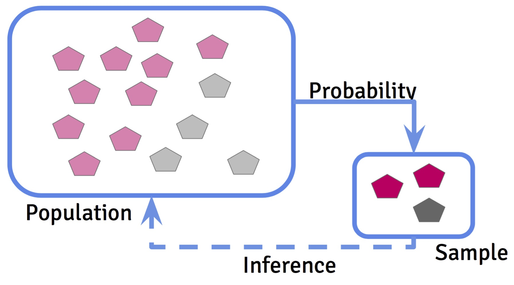
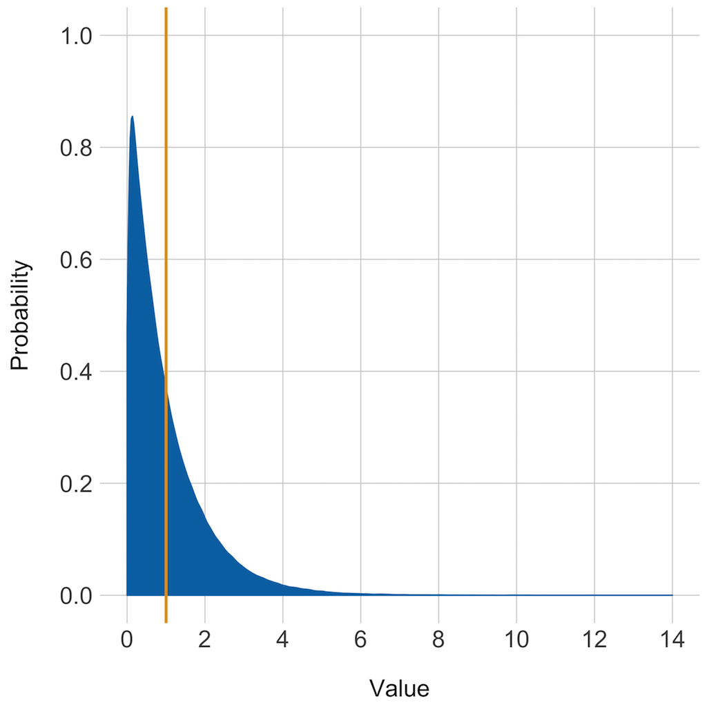
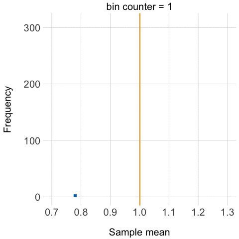
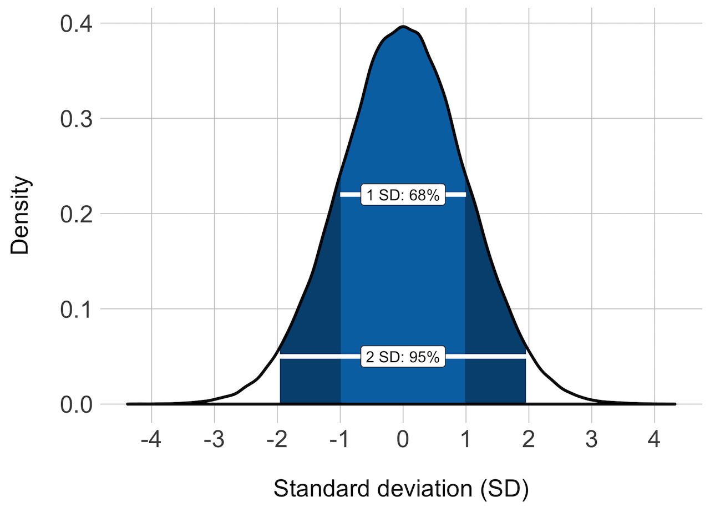
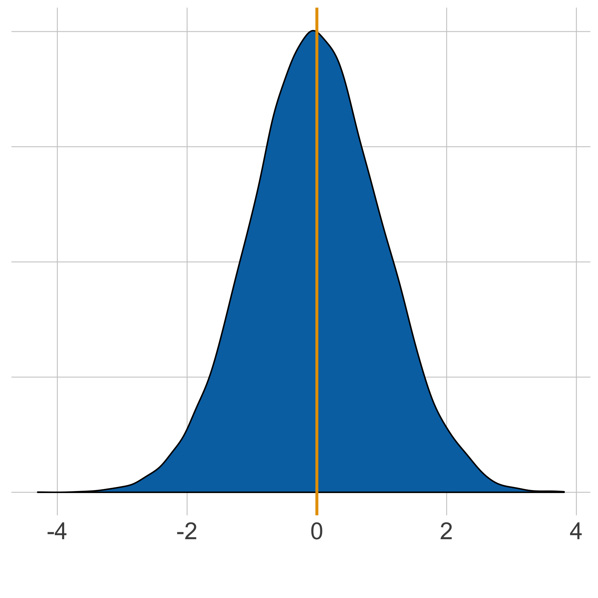
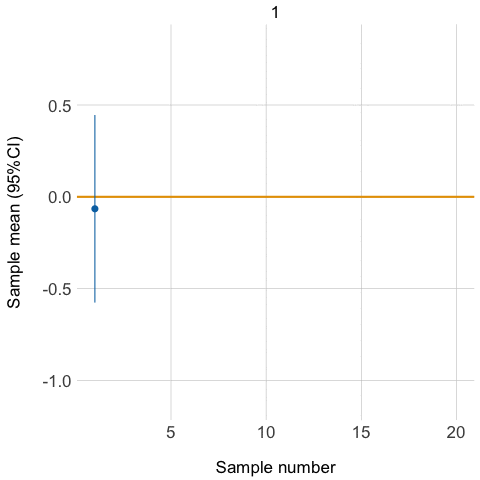
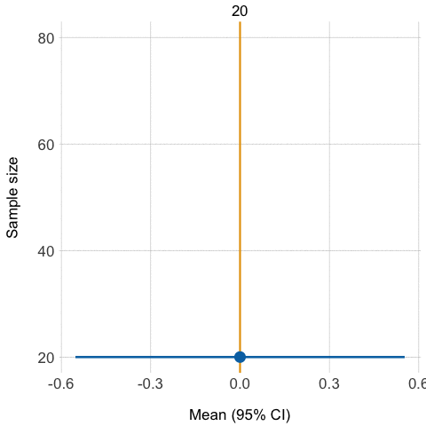

Lecture 7
=========
css: ../custom.css
transition: none
width: 960
height: 720
autosize: false

## Confidence intervals
- Confidence interval of the mean
- Confidence interval for the difference between two means
- Confidence interval for ratios and proportions
- Prediction (tolerance) intervals

    <h3 style="margin:0;">
        Introduction to Biostatistics
    </h3>
    

    By: Peter Kamerman &nbsp&nbsp (view at
    <a href="//painblogr.org/biostatistics/"target="_blank">painblogR</a>)
    

    

Recap
=====
title: hide
type: aside

A quick recap on:  
_- inference;_ 
_- normal distribution;_ 
_- sampling distributions_

Inference: the goal of statistics
=================================

Sampling distributions
======================
type: twocol

#### Starting distribution

****

#### Sampling distribution

$sd$ of sample means = $SEM$

The normal distribution
=======================

SEM
===
title: hide
type: aside

$SEM$: The certainty (precision) with which the sample mean ($\bar{x}$) estimates the population mean ($\mu$).

What is a confidence interval?
==============================
class: vcenter

### Confidence interval

The range of values within which you will find the true population mean with 95% certainty.

**OR**

If you took many samples from a population and calculated the 95% confidence interval for each sample, then 95% of those confidence intervals would contain the true population mean.

Demonstration: Mean (95% CI)
============================
type: twocol

### Population
($~\mu$ = 0,$~\sigma$ = 1, n = 20,000)

****

### Random samples
(20 samples at n = 20 / sample)

Confidence intervals
====================
class: vcenter

**Confidence intervals are defined by confidence limits:**

- (-100 to -20)

**Report confidence intervals as:**

- (12.3 to 32.5) _**or**_ (+12.3, +32.5)

- _**not**_ (12.3 - 32.5)$\rightarrow$ Can be ambiguous when there are negative numbers (-32.5 - -12.3)

Why do you need CIs if you have SEMs?
====================================
class: vcenter

CIs are more user-friendly than the SEMs

### Example:

> **Mean (SEM)**

    10 (3.5) mm

> **Mean (95% CI)**

    10 (3.1 to 18.9) mm

Confidence intervals
====================
type: twocol

### Population
($~\mu$ = 0,$~\sigma$ = 1, n = 20,000)

****

### Random samples
$\uparrow$ precision with $\uparrow$ sample size

Confidence intervals
====================
class: vcenter

### Hypothesis testing with CIs

The confidence interval for the difference between two means specifies a range of values within which the difference between the means of two populations may lie.

If we assume the **NULL** hypothesis is true, then that **interval should include zero**.

Confidence intervals: hypothesis testing
========================================
type: twocol

### Using p-values
**Pros:**
- Clear-cut yes or no answer
 
 

**Cons:**
- Arbitrary threshold (_p_< 0.05);
- Does not provide information on the magnitude of the effect.

****

### Using CIs
**Pros:**
- Clear-cut yes or no answer;
- Provides information on the magnitude of the effect.

Confidence intervals: hypothesis testing
========================================
class: vcenter

<table>
<caption>Interpreting CI for the difference between two means</caption>
 <thead>
  <tr>
   <th style="text-align:left;"> Trial number </th>
   <th style="text-align:left;"> CI of reduction in blood pressure </th>
   <th style="text-align:left;"> p &lt; 0.05 </th>
   <th style="text-align:left;"> Clinically significant* </th>
  </tr>
 </thead>
<tbody>
  <tr>
   <td style="text-align:left;"> 1 </td>
   <td style="text-align:left;"> (-9 to -1) </td>
   <td style="text-align:left;"> Yes </td>
   <td style="text-align:left;"> No </td>
  </tr>
  <tr>
   <td style="text-align:left;"> 2 </td>
   <td style="text-align:left;"> (-15 to 5) </td>
   <td style="text-align:left;"> No </td>
   <td style="text-align:left;"> Uncertain </td>
  </tr>
  <tr>
   <td style="text-align:left;"> 3 </td>
   <td style="text-align:left;"> (-15 to -1) </td>
   <td style="text-align:left;"> Yes </td>
   <td style="text-align:left;"> Uncertain </td>
  </tr>
  <tr>
   <td style="text-align:left;"> 4 </td>
   <td style="text-align:left;"> (-15 to -11) </td>
   <td style="text-align:left;"> Yes </td>
   <td style="text-align:left;"> Yes </td>
  </tr>
  <tr>
   <td style="text-align:left;"> 5 </td>
   <td style="text-align:left;"> (-9 to 5) </td>
   <td style="text-align:left;"> No </td>
   <td style="text-align:left;"> No </td>
  </tr>
</tbody>
</table>

    
* Based on a decrease of 10mmHg relative to placebo

    
(Luus et al., 1989)

Confidence intervals
====================
class: vcenter

**Confidence intervals can be calculated for most estimates**

_(e.g., medians, ratios, regression and correlation coefficients)_

**Tip:**

- Mean difference in the CI for ratios must exclude 1 to be significant.

Prediction intervals vs CIs
===========================

### Definition of a confidence interval:
- Interval in which the true population mean will fall with a certain probability;

- Confidence intervals are analogous to SEM:
$95\% CI: \bar{x} - (1.96 \times SEM)~to~\bar{x} + (1.96 \times SEM)$

### Definition of a prediction interval:
- An interval in which another individual observation will fall with a certain probability;

- Prediction intervals are analogous to SD:
$95\% CI: \bar{x} - (1.96 \times SD)~to~\bar{x} + (1.96 \times SD)$

Web resources
=============
class: vcenter

_**Basics**_
- Confidence intervals: [Statistics Glossry](http://www.stats.gla.ac.uk/steps/glossary/confidence_intervals.html), by Valerie J Easton & John H McColl.

- What is a Confidence Interval?: [Stat Trek](http://stattrek.com/estimation/confidence-interval.aspx), by Harvey Berman

tl;dr
=====

    

    "... a hypothesis test tells us whether the observed data are consistent with the null hypothesis, and a confidence interval tells us which hypotheses are consistent with the data."
    

    

     William C. Blackwelder 
        (Biostatistician, University of Maryland)
    

