Lecture 8
=========
css: ../custom.css
transition: none
width: 960
height: 720
autosize: false


## Testing for trends
- Correlation vs. regression
- Association vs causality
- Correlation
- Regression

<div style="position:fixed;bottom:10%">
    <h3 style="margin:0;">
        Introduction to Biostatistics
    </h3>
    <p style="font-style:italic;font-size:80%;margin-top:1%;margin-bottom:1%;">
    By: Peter Kamerman &nbsp&nbsp (view at
    <a href="//painblogr.org/biostatistics/"target="_blank">painblogR</a>)
    </p>
    
</div>


Correlation vs regression
==========================
class: vcenter

### Correlation

Correlation assesses the linear association or strength of relationship
between two variables.

### Regression
Regression describes the relationship between **x (independent)** and **y (dependent)** variables.

Association does not imply causality
====================================
class: vcenter

### "Bradford Hill" criteria for causality
- Strength of association
- Consistency
- Specificity
- Temporality
- Biological gradient
- Coherence (scientific reasoning)
- Experiment (manipulate independent variable)
- Analogy

Correlation
===========
title: none

<p class='vcenter' style='color:#FF0000;font-variant:italic;font-size:150%;'>Correlation</p>

Correlation
===========
class: vcenter

### Pearson’s product-moment correlation
- Variables measured on **interval** or **ratio** scale
- There needs to be a **linear relationship** between the variables
- There are no **outliers**
- Both variables should be approximately **normally distributed**

### Spearman’s rank correlation
- Variables measured on an **ordinal** or **interval** or **ratio** scale
- There is a **monotonic relationship** between the variables

Correlation...contd
===================

### Interpreting results of a correlation

**$~r~$**
- The strength and direction of relationship between variables. Values range from -1 _(perfect inverse linear relationship)_ to 1 _(perfect positive linear relationship)_.

**$~p$**
- Answers the question: what is the probability of obtaining a correlation coefficient $(r)$ as far from zero _(no linear relationship)_ as observed in your experiment assuming the null hypothesis is true?

Correlation...contd
===================

### Always plot your data first

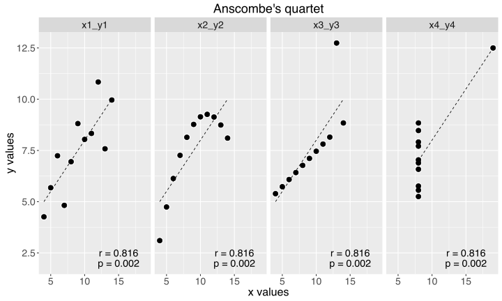

Correlation...contd
===================
type: tutorial

### Performing correlations in R

#### Pearson correlation


```r
# Data: USJudgeRatings
# Lawyer ratings of US Supreme Court judges
# FAMI: Familiarity with the law
# WRIT: Sound written judgements
foo <- USJudgeRatings[ , c('FAMI', 'WRIT')]
head(foo, 4)
```

```
               FAMI WRIT
AARONSON,L.H.   7.1  7.0
ALEXANDER,J.M.  8.0  7.9
ARMENTANO,A.J.  7.5  7.4
BERDON,R.I.     8.7  8.5
```

Correlation...contd
===================
type: tutorial

#### Pearson correlation...plot the data


```r
plot(foo$FAMI, foo$WRIT)
```

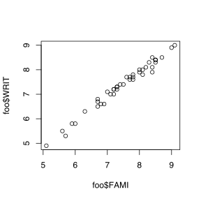

Correlation...contd
===================
type: tutorial

#### Pearson correlation...perform the test


```r
cor.test(foo$FAMI, foo$WRIT,
         method = 'pearson')
```

```

	Pearson's product-moment correlation

data:  foo$FAMI and foo$WRIT
t = 46.611, df = 41, p-value < 2.2e-16
alternative hypothesis: true correlation is not equal to 0
95 percent confidence interval:
 0.9827761 0.9949829
sample estimates:
      cor 
0.9906956 
```

Correlation...contd
===================
type: tutorial

#### Spearman correlation...plot the data


```r
# Extract 4th set of Anscombe's quartet
anscombe_4 <- anscombe[ , c('x4', 'y4')]
# Plot
with(anscombe_4, plot(x = x4, y = y4))
```

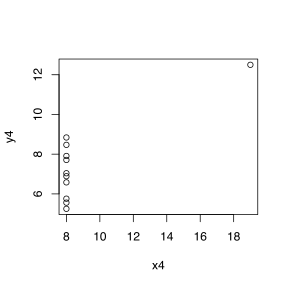

Correlation...contd
===================
title: none
type: tutorial
class: twocol


<br>
&nbsp;&nbsp;&nbsp;**Pearson correlation**


```r
with(anscombe_4,
cor.test(x = x4, y = y4,
    method = 'pearson'))
```

```

	Pearson's product-moment correlation

data:  x4 and y4
t = 4.243, df = 9, p-value = 0.002165
alternative hypothesis: true correlation is not equal to 0
95 percent confidence interval:
 0.4246394 0.9507224
sample estimates:
      cor 
0.8165214 
```

****

<br>
&nbsp;&nbsp;&nbsp;**Spearman correlation**


```r
with(anscombe_4,
cor.test(x = x4, y = y4,
    method = 'spearman'))
```

```

	Spearman's rank correlation rho

data:  x4 and y4
S = 110, p-value = 0.1173
alternative hypothesis: true rho is not equal to 0
sample estimates:
rho 
0.5 
```

Linear regression
=================
title: none

<p class='vcenter' style='color:#FF0000;font-variant:italic;font-size:150%;'>Linear regression</p>

Linear regression
=================
class: vcenter

### Assumptions when performing linear regression

- There is a linear trend between $x$ and $y$.

- The observations in the sample are independent.

- $x$ is measured without error.

- The **residuals** are normally distributed _(more about this later)_.

- The **residuals** have the same variance for all fitted values of $y$  _(homoskedastic, more about this later)_.


Linear regression
=================
class: vcenter

### Selecting the best-fit straight line

- Unless there is a correlation, regression is meaningless

- Best-fit line is the regression line that **minimizes the total variability** between data points and line

Linear regression...contd
=========================

### Selecting the best-fit line: the least squares method

Find the line that **minimizes the sum of the squares** of the vertical distances of data points from the line (least squares regression).

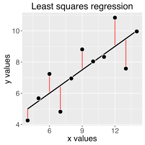

Linear regression...contd
=========================
class: vcenter

### Variability about the regression line

- **Residual mean square:** The sum of average squared deviation of the data about the line.

- **Standard error of the estimate $(S_{y.x})$:** The square root of the residual mean square. $S_{y.x}$ indicates the accuracy with which the fitted regression function predicts the dependence of Y on X

Linear regression...contd
=========================

### Regression coefficients

$y = a + bx$

- **$a$: Y-axis intercept of the line:**
    - Only really of interest if $x = 0$.
    - **$S_a$:** Standard error of the intercept.

- **$b$: Regression coefficient / slope of the line**
    - Interpreted as: mean change in the response variable for one unit of change in the predictor variable.
    - Sign (+ or -) indicates the direction of the relationship.
    - **$S_b$:** Standard error of the slope.

Linear regression...contd
=========================
class: vcenter

### Coefficient of determination $(R^2)$

- Fraction of total variation in the dependent variable that can be _“explained”_ by the regression equation.

- Fraction of variance shared by two variables _(correlation)_

Linear regression...contd
=========================
type: tutorial
class: vcenter

### Performing linear regression in R


```r
# Anscombe's quartet
head(anscombe, 3)
```

```
  x1 x2 x3 x4   y1   y2    y3   y4
1 10 10 10  8 8.04 9.14  7.46 6.58
2  8  8  8  8 6.95 8.14  6.77 5.76
3 13 13 13  8 7.58 8.74 12.74 7.71
```

Linear regression...contd
=========================
type: tutorial
class: vcenter

### Performing linear regression in R

    lm(formula, data, ...)


```r
# Set 1 of Anscombe's quartet
anscombe_1 <- anscombe[ , c('x1','y1')]

# Linear regression
#
mod_1 <- lm(y1 ~ x1, data = anscombe_1)

# View model
summary(mod_1)
```

Linear regression...contd
=========================
type: tutorial

    # View model
    summary(mod_1)


```

Call:
lm(formula = y1 ~ x1, data = anscombe_1)

Residuals:
    Min      1Q  Median      3Q     Max 
-1.9213 -0.4558 -0.0414  0.7094  1.8388 

Coefficients:
            Estimate Std. Error t value Pr(>|t|)   
(Intercept)    3.000      1.125    2.67   0.0257 * 
x1             0.500      0.118    4.24   0.0022 **
---
Signif. codes:  0 '***' 0.001 '**' 0.01 '*' 0.05 '.' 0.1 ' ' 1

Residual standard error: 1.24 on 9 degrees of freedom
Multiple R-squared:  0.667,	Adjusted R-squared:  0.629 
F-statistic:   18 on 1 and 9 DF,  p-value: 0.00217
```

Linear regression and correlation
================================

### Linear regression / correlation rules

- Always plot data _(scatterplot)_

    - Check for linear relationship

    - Check for outliers/influence point

- Check for non-normality and heteroskedasticity of residuals

- Avoid extrapolation beyond the range of $x$-values measured

- Beware of $x$ on $x$ correlations / regressions

- Only plot a regression line when reporting a correlation if the correlation is significant, and regression makes sense.

Linear regression...contd
=========================

### Linear regression diagnostics

**Checking to determine whether:**

- There is a linear trend between the $x$ and $y$ variables

- There are outliers or leverage points

- The residuals are normally distributed

- The residuals have the same variance for all fitted values of $y$  _(homoskedastic)_.

Linear regression...contd
=========================
type: twocol

### Is there a linear trend between the $x$ and $y$ variables

- Generate a scatterplot and look at the trend

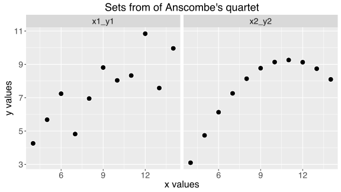

Linear regression...contd
=========================
class: vcenter

### Are there outliers or leverage points?

- **Outlier:** extreme / unexpected value for the dependent variable (large residual)

- **Leverage point:** values at the extremes of the independent variable range, and which the regression line passes near to.

- **Influence point:** An extreme value that _'pulls'_ the regression line towards that point.

Linear regression...contd
=========================

### Are there outliers or leverage points?

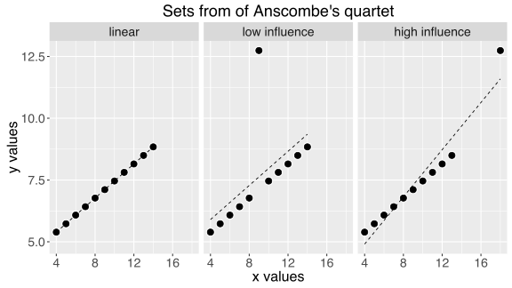

Statistical tests for outliers, leverage points, and influence points are available (e.g., Cook's D), but are not covered here.

Linear regression...contd
=========================
class: vcenter

### Are the residuals normally distributed?

- Quantile-Quantile plot _(QQ-plot)_

### Do the residuals have the same variance for all fitted values of $y$?

- Fitted vs residuals plot

Linear regression...simple regression
=====================================
type: tutorial


```r
# Make a dataset
foo <- data_frame(x = rnorm(50), y = x + runif(50))
# summary of y1 vs x1 regression
mod <- lm(y ~ x, data = foo)
summary(mod)
```

```

Call:
lm(formula = y ~ x, data = foo)

Residuals:
    Min      1Q  Median      3Q     Max 
-0.4453 -0.2659 -0.0322  0.2635  0.5335 

Coefficients:
            Estimate Std. Error t value Pr(>|t|)    
(Intercept)   0.4394     0.0425    10.3  8.6e-14 ***
x             1.0292     0.0414    24.9  < 2e-16 ***
---
Signif. codes:  0 '***' 0.001 '**' 0.01 '*' 0.05 '.' 0.1 ' ' 1

Residual standard error: 0.298 on 48 degrees of freedom
Multiple R-squared:  0.928,	Adjusted R-squared:  0.926 
F-statistic:  618 on 1 and 48 DF,  p-value: <2e-16
```

====================================
type: tutorial
class: twocol

**Diagnostic plot 1: Homoskedasticity**

```r
plot(x = mod$fitted, y = mod$residuals)
abline(h = 0)
```

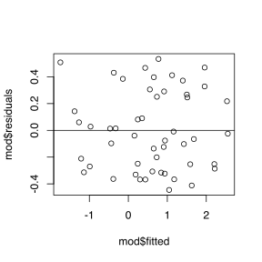

****

**Diagnostic plot 2: Gaussian residual ditribution**

```r
qqnorm(mod$residuals)
qqline(mod$residuals)
```

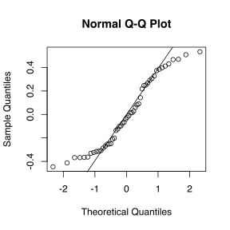

====================================
type: tutorial
class: twocol

**Diagnostic plot 1: Heteroskedasticity**
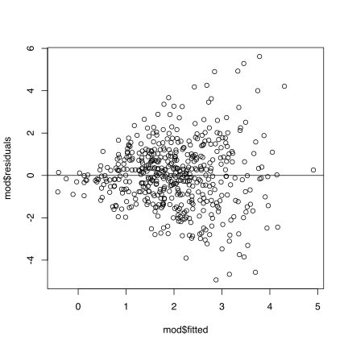

****

**Diagnostic plot 2: Skewed residual distribution**
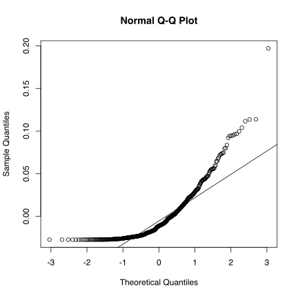

Generalized Linear Models (GLM)
==============================

Flexible generalization of ordinary linear regression that allows for response variables that have non-Gaussian error distribution.

Generalization of the linear models performed by relating the response variable via a **link function**

### Most common

#### Logistic regression
- Binary outcome variable (e.g., 'yes' or 'no')

        glm(y ~ x, family = 'logit', data = foo)

Why ANOVA is a linear regression
================================


```r
# Plant weight data (A Dobson, 1990)
control <- c(4.17, 5.58, 5.18, 6.11, 4.50, 4.61, 5.17, 4.53, 5.33, 5.14)
treatment <- c(4.81, 4.17, 4.41, 3.59, 5.87, 3.83, 6.03, 4.89, 4.32, 4.69)

# Make dataframe
data <- data_frame(group = factor(rep(c('Control','Treatment'),
                                      each = 10)),
                   weight = c(control, treatment))
head(data, 3)
```

```
# A tibble: 3 x 2
    group weight
   <fctr>  <dbl>
1 Control   4.17
2 Control   5.58
3 Control   5.18
```

```r
# Fit ANOVA model
mod_aov <- aov(weight ~ group, data = data)

# Fit linear regression model
mod_lm <- lm(weight ~ group, data = data)
```


========================================
class: twocol

&nbsp;&nbsp;&nbsp;**Plot**
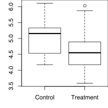


&nbsp;&nbsp;&nbsp;**ANOVA**

```
            Df Sum Sq Mean Sq F value Pr(>F)
group        1   0.69   0.688    1.42   0.25
Residuals   18   8.73   0.485               
```

```
# A tibble: 2 x 2
      group  Mean
     <fctr> <dbl>
1   Control  5.03
2 Treatment  4.66
```

****

&nbsp;&nbsp;&nbsp;**Linear regression**

```

Call:
lm(formula = weight ~ group, data = data)

Residuals:
    Min      1Q  Median      3Q     Max 
-1.0710 -0.4938  0.0685  0.2462  1.3690 

Coefficients:
               Estimate Std. Error t value Pr(>|t|)    
(Intercept)       5.032      0.220   22.85  9.5e-15 ***
groupTreatment   -0.371      0.311   -1.19     0.25    
---
Signif. codes:  0 '***' 0.001 '**' 0.01 '*' 0.05 '.' 0.1 ' ' 1

Residual standard error: 0.696 on 18 degrees of freedom
Multiple R-squared:  0.0731,	Adjusted R-squared:  0.0216 
F-statistic: 1.42 on 1 and 18 DF,  p-value: 0.249
```


Web resources
=============
class: vcenter

_**Basics**_
- Linear regression: [r-statistics.co](http://r-statistics.co/Linear-Regression.html), by Selva Prabhakaran.

- Regression and correlation: [Cookbook for R](http://www.cookbook-r.com/Statistical_analysis/Regression_and_correlation/), by Winston Chang.


tl;dr
=====

<div class="hcenter" style="width:80%;">
    <p style="font-size:150%;font-style:italic;text-align:center;margin-top:100px;">
    "The complexities of cause and effect defy analysis."
    </p>
    <p style="text-align:center">
     Urban Chronotis [Reg]<br>
        <span style="font-style:italic;font-size:80%;">Regius Professor of Chronology<br>In: Douglas Adams' "Dirk Gently's Holistic Detective Agency"</span>
    </p>
</div>
